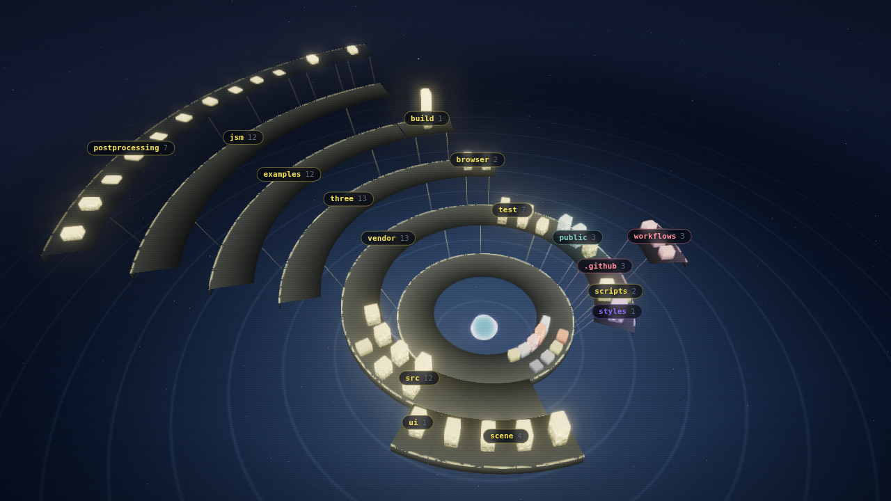
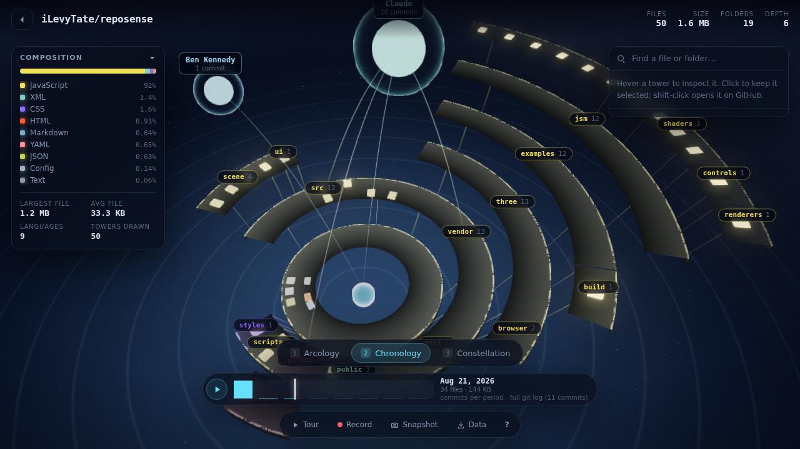
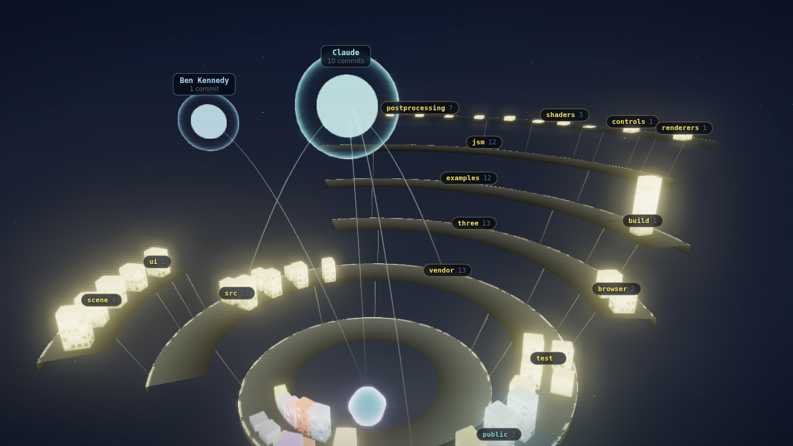

<div align="center">

# RepoSense

**Visualize your repo cinematically.**

Files become towers. Folders become terraces. A repository assembles itself into
a structure you can fly through — sized by bytes, coloured by language, lit by
how recently it changed.

[**Open the visualizer →**](https://ilevytate.github.io/reposense/)

<a href="https://ilevytate.github.io/reposense/#/iLevyTate/reposense">
  
</a>

<sub>RepoSense rendering itself — clicking any shot opens this repository in the live explorer.</sub>

<table>
  <tr>
    <td width="50%"><a href="https://ilevytate.github.io/reposense/#/iLevyTate/reposense"></a></td>
    <td width="50%"><a href="https://ilevytate.github.io/reposense/#/iLevyTate/reposense"></a></td>
  </tr>
  <tr align="center">
    <td><sub><b>Chronology</b> — scrub the git history; files flare as they are created</sub></td>
    <td><sub><b>Constellation</b> — who built which part of it</sub></td>
  </tr>
</table>

<sub><b>Arcology</b> above — rings are depth, height is size, colour is language.</sub>

</div>

---

## Three ways to use it

| | | |
| --- | --- | --- |
| **[The website](#1-the-website)** | Paste `owner/repo` | Nothing to install |
| **[The CLI](#2-the-cli)** | `npx github:iLevyTate/reposense` | Private repos, full history |
| **[The Action](#3-the-action)** | An SVG in your README | Refreshes itself |

---

## 1. The website

Go to **[ilevytate.github.io/reposense](https://ilevytate.github.io/reposense/)**
and type a repository. It builds in a few seconds. There is no backend — the
page talks to the GitHub API from your browser.

Anything recognisable works in the box:

```
sindresorhus/got
https://github.com/pallets/flask
git@github.com:charmbracelet/bubbletea.git
```

Every view is linkable: `…/reposense/#/pallets/flask` loads that repo directly.

> **On rate limits.** Anonymous GitHub API access allows 60 requests an hour per
> IP. The structure costs about five requests; the history replay that powers
> Chronology costs one per commit, so anonymously it stops at the newest 40
> commits and says so. Add a
> [personal access token](https://github.com/settings/tokens) under **Options**
> for 5,000 an hour, a replay of up to 1,000 commits, and access to private
> repositories. It is stored in your
> browser and sent only to `api.github.com` — there is no RepoSense server for it
> to reach.

## 2. The CLI

```bash
npx github:iLevyTate/reposense
```

Run it inside any git repository. It scans the working tree, replays the commit
log, writes `reposense.json`, and opens the viewer pointed at it. Node 18+, no
dependencies, nothing leaves your machine.

It exists because it is strictly better wherever it applies:

|                     | Website                     | CLI               |
| ------------------- | --------------------------- | ----------------- |
| Private repositories | needs a token               | just works        |
| Rate limits         | 60/hour anonymous           | none              |
| Commit history      | newest slice, on by default | all of it         |
| Per-file authorship | deep scan only              | always            |
| Growth timeline     | deep scan only              | always            |

```bash
reposense                        # scan . and open the viewer
reposense ~/code/api --json      # write the JSON only, no browser
reposense --svg docs/repo.svg    # render a static SVG
reposense --no-history           # skip the git log pass (fast on huge repos)
reposense -c 500                 # only the newest 500 commits
```

The `reposense.json` it writes can be **dropped straight onto the website** —
drag it anywhere on the start screen. That is the path for private code: the
visualization runs in your browser and the data never travels.

## 3. The Action

Render your repository to an SVG on every push and commit it back:

```yaml
name: Visualize
on:
  push:
    branches: [main]

permissions:
  contents: write

jobs:
  render:
    runs-on: ubuntu-latest
    steps:
      - uses: actions/checkout@v4
        with:
          fetch-depth: 0        # history supplies churn and authorship
      - uses: iLevyTate/reposense@main
        with:
          output: reposense.svg
          commit: 'true'
```

There is nothing to install and no browser involved — the renderer is the same
layout engine the 3D viewer uses, projected isometrically and written straight
out as vector. A repository of a few thousand files lands in about 25 KB.

### Inputs

| Input | Default | |
| --- | --- | --- |
| `path` | `.` | Directory to scan |
| `output` | `reposense.svg` | Where to write the SVG |
| `theme` | `dark` | `dark` or `light` |
| `width` | `1280` | Width in px; height follows the drawing (SVG) or the frame (video) |
| `animate` | `false` | Build the structure in on a loop (SVG) |
| `height` | `720` | Frame height, video only |
| `fps` | `30` | Frames per second, video only |
| `seconds` | *(full tour)* | Video length — the whole tour is about 48s |
| `chrome` | `false` | Keep the HUD visible in video |
| `commits` | *(all)* | Cap history at the newest N commits |
| `history` | `true` | `false` skips the git log pass entirely |
| `json` | — | Also write the raw `reposense.json` here |
| `commit` | `false` | Commit the result back to the branch |
| `commit-message` | *(see `action.yml`)* | Message used when committing |

Outputs: `output` (path), `format`, `files` (count), and `changed` (`true` when
the render differs from what was already committed — useful for gating later
steps). `svg` remains as an alias for `output`.

### Video and GIF

The `output` extension picks the format. `.svg` needs nothing installed; `.gif`,
`.mp4`, `.webm` and `.webp` render the full cinematic tour through a headless browser and
encode it with ffmpeg, both of which the action installs into its own directory
when asked for.

```yaml
      - uses: iLevyTate/reposense@main
        with:
          output: docs/tour.mp4
          seconds: '20'
          fps: '30'
```

Frames are requested by timestamp rather than captured in real time, so a runner
falling back to software rasterisation still produces smooth output — it simply
takes longer to render, never choppier.

**Which format to embed.** Measured on this repository:

| | 480×270, 6s | 640×360, 8s |
| --- | --- | --- |
| Animated SVG | **24 KB** | **24 KB** |
| GIF | 1.5 MB | 3.6 MB |
| MP4 | 214 KB | 422 KB |

For a README, prefer the **animated SVG**: it is two orders of magnitude smaller
than the GIF, stays sharp at any width, and renders inline from a repository
path. Reach for GIF only if you need a raster the SVG cannot give you.

MP4 and WebM are the best-looking and smallest of the three, but a repository
path to one does **not** play inline in a README — GitHub only renders a video
player for files uploaded through its own comment or release attachments. Use
them for release notes, issues, and social posts, and link to them from the
README.

### Put it in your README

The rendered SVG is a few dozen kilobytes and refreshes itself on every push:

```markdown

```

Make it clickable so readers land in the live explorer on *your* repository:

```markdown
[](https://ilevytate.github.io/reposense/#/OWNER/REPO)
```

To serve both colour schemes, render twice and let the browser pick:

```html
<a href="https://ilevytate.github.io/reposense/#/OWNER/REPO">
  <picture>
    <source media="(prefers-color-scheme: dark)" srcset="reposense-dark.svg">
    <source media="(prefers-color-scheme: light)" srcset="reposense-light.svg">
    
  </picture>
</a>
```

That is exactly what the image at the top of this file does — see
[`.github/workflows/visualize.yml`](.github/workflows/visualize.yml), which
renders both variants and commits them. The workflow skips its own bot commits,
so it settles after one pass instead of looping.

#### It moves, without being a GIF

With `animate: 'true'` the structure builds itself in on a loop. The motion is
CSS *inside* the SVG, which matters: GitHub strips `<script>` from embedded SVG
but still runs stylesheets when the file is rendered as an image. So it animates
in a README where anything script-driven would sit there dead — at about 7% more
bytes than the still version, rather than the megabytes a GIF of the same thing
would cost, and it stays sharp at any width.

The cycle spends most of its length fully built, so a reader arriving at any
moment sees the finished structure rather than a half-drawn one. Anything that
ignores the CSS — and anyone who has asked their system for reduced motion —
gets the still frame.

If you want a video instead, there are two ways: the Action renders one in CI
(see [Video and GIF](#video-and-gif)), or the web app records one live — press
**R** and it writes a WebM of the tour, including your own camera moves.

Prefer not to commit an image? Point the Action at a temporary path and upload it
as an artifact instead; every render is deterministic, so the same tree always
produces the same file.

---

## Reading the structure

The layout is a **radial icicle**: depth in the tree maps to a concentric ring
*and* to altitude, so a repository reads as a stepped ziggurat rather than a flat
sunburst.

| You see | It means |
| --- | --- |
| **Ring** | How deep a file sits in the tree |
| **Terrace** | A directory — everything it contains stands on it |
| **Tower** | A file; height is its size, on a log scale |
| **Colour** | Language |
| **Glow** | Churn — lines added and deleted, where history is available |
| **Bridge** | The ramp from a folder's slice up to its own terrace |
| **Core** | The repository root, at the centre of it all |

A directory's slice of the disc is its share of the codebase. Sibling order is
deterministic, so the same repository always produces the same structure — and
the same SVG, byte for byte.

### Three views

- **Arcology** — the structure itself. Hover a tower to inspect it, click to keep
  it selected, shift-click to open it on GitHub, search to isolate a subtree.
- **Chronology** — scrub the repository's history. Where creation dates are
  known, towers rise as history reaches them; otherwise the timeline drives churn
  heat only, and the panel says so rather than pretending.
- **Constellation** — contributors in orbit, sized by commits, with light-arcs to
  the directories they actually touched.

Press **T** for a scripted camera tour through all three, **R** to record it to a
WebM file.

### Keyboard

| | |
| --- | --- |
| `1` `2` `3` | Switch view |
| `T` | Play the tour |
| `R` | Record video |
| `P` | Save a PNG |
| `F` | Search |
| `Space` | Play/pause the timeline |
| `0` | Reset the view |
| `Esc` | Clear selection · stop the tour |
| `Shift`+click | Open the file on GitHub |

### Displays

Framing adapts to the viewport. three.js fixes the *vertical* field of view and
this structure is far wider than it is tall, so without a correction a portrait
phone crops the outer rings off the sides while an ultrawide strands the
structure in an empty frame. RepoSense corrects both ways — pulling back on
narrow screens, pushing in slightly on wide ones — and re-frames when a phone
rotates. Verified from 390×844 to 5120×1440.

---

## Honesty about the data

A visualization that quietly invents data is worse than none, so:

- **Sizes and structure** are always real, straight from the git tree.
- **Churn, authorship and creation dates** need history. The commit-list API
  does not return file lists, so the website's **deep scan** — on by default —
  opens recent commits one request each to recover them, and the scrubber
  labels exactly how many commits it covers. The CLI and the Action replay the
  entire git log by default.
- When history is missing, Chronology is **disabled** and the panel explains why,
  rather than animating something meaningless.
- On very large repositories the smallest files fold into `…N more files` towers
  to protect the frame rate. The totals still describe every file, and the panel
  reports how many were folded.
- If GitHub truncates the tree for an enormous repository, the panel says so.

---

## How it works

No backend, no build step. The site is static files on GitHub Pages and the
browser calls the GitHub API directly.

```
index.html            shell and import map
404.html              bounces stray paths back into the app
src/
  main.js             routing, loading, interaction
  github.js           GitHub REST client, deep scan, token handling
  model.js            flat file list  ->  weighted hierarchy
  layout.js           radial icicle layout and camera framing
  palette.js          language detection and colours
  links.js            GitHub URL construction
  svg.js              static isometric renderer (no DOM, no browser)
  scene/
    stage.js          renderer, camera rig, bloom pipeline, starfield
    arcology.js       terraces, instanced towers, bridges, picking
    constellation.js  contributor orbits and attribution arcs
    cinema.js         scripted camera tour, WebM recorder
  ui/hud.js           panels, inspector, tooltip, toasts
scripts/reposense.mjs the local scanner (zero dependencies)
scripts/record.mjs    offline recorder: tour -> gif / mp4 / webm / webp
action.yml            the GitHub Action
vendor/three/         three.js, vendored so there is no CDN dependency
```

A few decisions worth knowing if you dig in:

- **All towers are one `InstancedMesh`.** Colour, churn, search state and
  timeline presence are per-instance attributes, so 14,000 files cost one draw
  call and scrubbing history costs one buffer upload.
- **Tower altitude lives in the instance matrix, not the shader.** Terraces
  offset altitude in their vertex shader for a free reveal animation, but the
  raycaster reads matrices — towers that floated in the shader would be picked at
  the wrong height.
- **Every material is a custom unlit shader**, authored deliberately bright so the
  bloom threshold turns crowns and rim strips into light sources. The scene
  therefore contains no lights and no fog at all.
- **Camera framing follows the weighted centroid**, not the origin. A radial
  layout is only centred when the tree is balanced, and real repositories have a
  vendored dependency stretching one thin arm into the distance.
- **The layout engine is pure maths** — no DOM, no three.js. That is what lets the
  Action reuse it to render SVG in a runner with no browser.
- **The recorder asks for frames by timestamp**, it does not capture in real
  time. Every animation is a function of the tour clock, so a frame is
  reproducible; a slow machine takes longer but never drops or smears one. The
  single-frame render path deliberately skips `controls.update()`, because
  damping is stateful and would make the same timestamp depend on what was
  rendered before it.

### Running it locally

```bash
git clone https://github.com/iLevyTate/reposense
cd reposense
npm start          # http://localhost:4173
```

### Tests

```bash
npm test           # unit + CLI, no dependencies, ~2s
npm ci && npx playwright install chromium
npm run test:browser
```

`npm test` needs nothing installed. It runs on Node's built-in test runner and
covers the data pipeline, the SVG renderer, the GitHub client (against a stubbed
API) and the CLI end to end.

The browser test is separate because it needs Chromium, and it is the one that
matters most: every defect found while building this was a runtime one — a
renderer that drew nothing, a HUD stuck at `opacity: 0`, a handler wired to the
wrong argument — and none of it is reachable without running the page. It boots
the real site and drives it, failing on any JavaScript error.

Both run on every pull request.

### Deploying your own

Fork it, then **Settings → Pages → Source: GitHub Actions**. There is no build
step: the workflow syntax-checks the sources, regenerates the bundled example
from the repo's own git log, and uploads the tree as-is.

What keeps the deployed page the *whole* product rather than a static shell:

- **`.nojekyll`** stops GitHub running the tree through Jekyll, which would
  mangle `vendor/` and drop paths it considers private.
- **Every path is relative**, including the import map, so the app works at
  `/reposense/`, at a user site, or behind a custom domain.
- **Routing lives in the location hash**, so deep links, the Back button and
  refreshes work with no server rewrite rules.
- **`404.html`** returns stray paths to the app, turning
  `…/reposense/owner/repo` into `…/reposense/#/owner/repo`.

## License

MIT — see [LICENSE](LICENSE).
